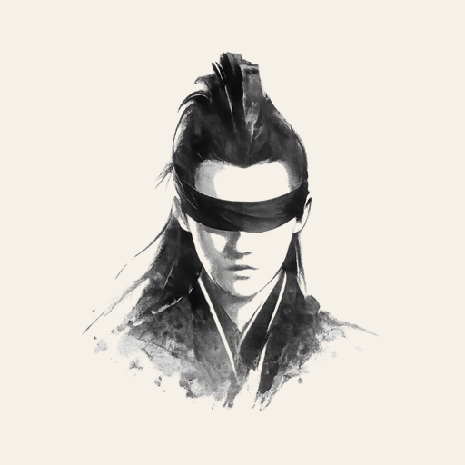

# WuZhu – Short Video Breaker

<br>

[](LICENSE)

**WuZhu** is a free, open source Android app that blocks short-video feeds before they hook
you. An on-device Accessibility Service detects short-video feeds — YouTube Shorts,
Instagram/Facebook Reels, TikTok, RedNote (Xiaohongshu), and anything with the same structure
— by matching their video render surfaces, then covers them with an overlay so they can't be
watched.

Detection is purely structural (video render surface + swipeable feed container), not tied to
a fixed list of apps. Everything runs on-device; nothing is recorded or sent anywhere.

Please join Test:
Android: https://play.google.com/store/apps/details?id=me.hanyuliu.wuzhu
Web: https://play.google.com/apps/testing/me.hanyuliu.wuzhu

## Features

- Blocks short-video feeds in any app, detected structurally instead of by an app allowlist
- Covers YouTube Shorts, Instagram/Facebook Reels, TikTok, RedNote (Xiaohongshu), and similar
  feeds out of the box
- Gives you a brief moment to notice before fading in a cover, instead of blocking instantly
- Tracks how many videos you've skipped today, right on the cover
- 100% on-device — nothing is recorded, stored, or sent anywhere
- Requires only the Accessibility Service; see [Permissions](#permissions) below for details

## Why "WuZhu"?

"WuZhu" 的发音刚好碰上两个点题的中文词：

- **捂住** —— 短视频一开始播，立刻拿一层遮罩把画面"捂住"，让你看不到。
- **五竹** —— App 图标画的是《庆余年》里的角色"五竹"，常年用一块布蒙着双眼，不受世间纷繁所扰。

## Build & install

```
./gradlew installDebug
```

or open the project folder in Android Studio and run it.

## Enable it

Launch WuZhu, tap **Enable Accessibility Service**, find **WuZhu** in the list, and turn it
on. Android will show a warning about the permissions an accessibility service has — this is
expected; WuZhu only reads on-screen content to detect video elements and never transmits it
anywhere.

https://github.com/user-attachments/assets/d29cdde4-35f4-4ffe-bb5b-f3bccf8eac2a

## How it works

- `ShortVideoAccessibilityService` scans the on-screen accessibility tree of whichever app is
  in the foreground on every window/content change — it isn't scoped to a package allowlist.
- It looks for nodes whose class name is (or contains) `VideoView`, `TextureView`, or
  `SurfaceView` (`BlockRules.VIDEO_SURFACE_CLASSES`) — the Android framework render surfaces
  that video is ultimately drawn to, regardless of which app or UI wraps it. Matching by
  class-name substring also catches custom subclasses (e.g. RedNote's `XYVideoView`).
- A matched surface only counts as a short-video feed if it also sits inside a swipeable
  paging container (`RecyclerView`/`ViewPager`) — either as a descendant (apps like TikTok
  that give each feed item its own player) or by exactly sharing bounds with one elsewhere in
  the tree (apps like YouTube Shorts that reuse a single shared surface across the feed). This
  is what distinguishes a feed video from a video sitting in a plain, non-scrolling screen.
- Every match is covered with a plain window (`OverlayController.kt`) that fades in over 10
  seconds, sized and positioned to exactly that node's on-screen bounds, added via
  `TYPE_ACCESSIBILITY_OVERLAY` — no `SYSTEM_ALERT_WINDOW` permission needed. The window is
  `FLAG_NOT_TOUCHABLE`, so it's purely visual — taps and swipes always reach the app
  underneath. Swiping to the next video resets the countdown.
- A running count of videos skipped today is tracked locally (`PrefsManager.kt`) and shown
  once a cover finishes fading in.

## A note on selectors

The render-surface class match is unlikely to break across app updates, since these are
stable Android framework classes, not an app's internal resource IDs. It does mean detection
only kicks in once a video actually starts rendering a frame — during a brief loading/buffering
moment there may be nothing to cover yet. If a video isn't getting covered at all, inspect the
on-screen tree to find its actual class name (e.g. `adb shell uiautomator dump` and pull the
class= value for the video node), then add it to `BlockRules.VIDEO_SURFACE_CLASSES` and
rebuild.

## Project layout

```
wuzhu/src/main/java/me/hanyuliu/wuzhu/
  PrefsManager.kt                   daily skipped-video count (SharedPreferences)
  BlockRules.kt                     video render-surface + paging-feed matching rules
  OverlayController.kt              draws/positions cover windows
  ShortVideoAccessibilityService.kt scans the screen and drives the overlay
  MainActivity.kt                   settings UI
```

## Permissions

Only `BIND_ACCESSIBILITY_SERVICE` (declared on the service, required by the OS). No internet,
storage, or overlay permission is requested.

## License

This project is licensed under the Apache License 2.0. See the [LICENSE](LICENSE) file for
details.
